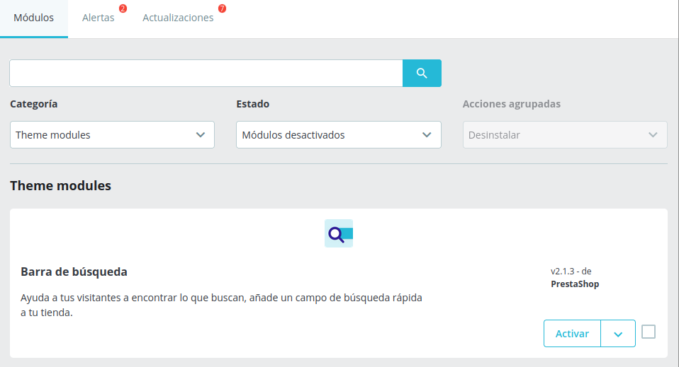
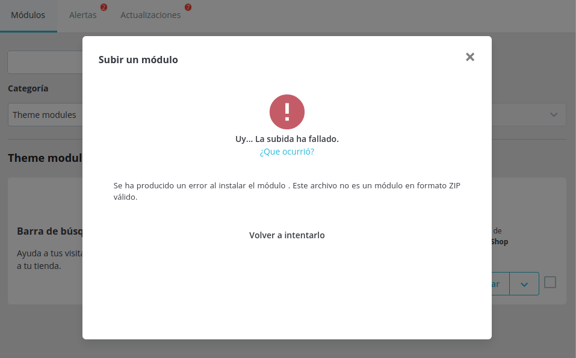

# Ejercicio 2
# Ruben Abreu Gonzalez

## Indice
- [Ejercicio 2](#ejercicio-2)
- [Ruben Abreu Gonzalez](#ruben-abreu-gonzalez)
  - [Indice](#indice)
    - [Clonar el modulo](#clonar-el-modulo)
    - [Cambiar la configuracion del modulo](#cambiar-la-configuracion-del-modulo)
    - [Añadir un mensaje personalizado](#añadir-un-mensaje-personalizado)
    - [Registrar busquedas en un log](#registrar-busquedas-en-un-log)
    - [Instalar el modulo en prestashop](#instalar-el-modulo-en-prestashop)

### Clonar el modulo
- Entrar en la terminal de Prestashop
> docker exec -it prestashop bash

- Copiar el archivo modules/ps_searchbar y renombrarlo
> cp modules/ps_searchbar ./modules/ps_searchbar_custom

### Cambiar la configuracion del modulo
- cambiar el nombre del modulo en ps_searchbar.php
```php
$this->name = 'ps_searchbar_custom'
$this->displayName = $this->trans('Barra de busqueda customizada', [], 'Modules.Searchbar.Admin');
        $this->description = $this->trans('Barra de busqueda para filtrar el contenido.', [], 'Modules.Searchbar.Admin');
```

### Añadir un mensaje personalizado
- modificar el archivo ps_searchbar.tpl
```html
<p class="custommessage">Busca lo que necesites, ¡encontraremos algo para ti! </p>
```

### Registrar busquedas en un log
- añadir un mensaje cada vez que se realice una busqueda y guardarlo en el archivo /var/logs/search.log
```php
$searchQuery = Tools::getValue('search_query');
        if ($searchQuery) {
                $logMessage = '[' . date('Ymd H:i:s') . '] User searched for: ' . $searchQuery . PHP_EOL;
                file_put_contents(_PS_ROOT_DIR_ . '/var/logs/search.log', $logMessage, FILE_APPEND);
        }
```

### Instalar el modulo en prestashop
- acceder a los modulos, desinstalar el searchbar original y añadir el personalizado



> [!CAUTION]
> No nos deja subir el módulo porque dice que el formato del zip es erronéo. Sin embargo no lo es.