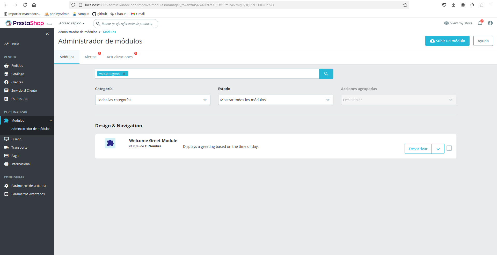
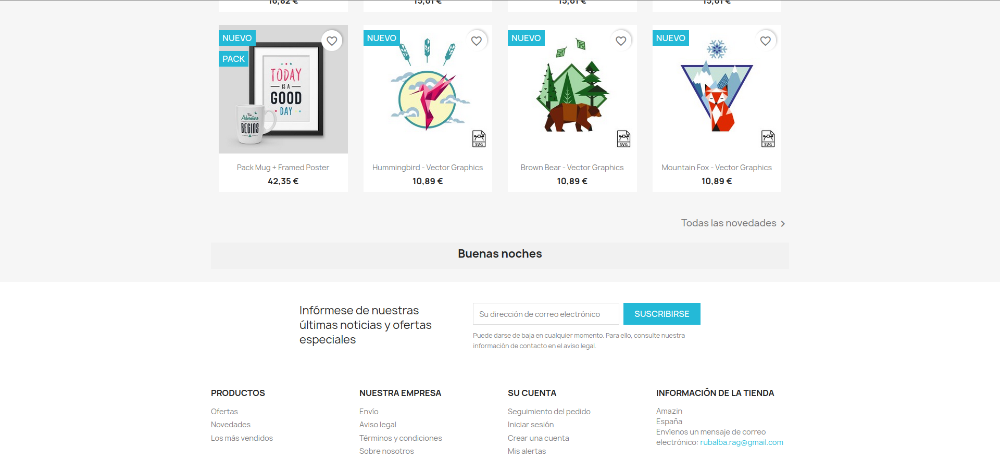

# Ruben Abreu Gonzalez

## Indice
- [Ruben Abreu Gonzalez](#ruben-abreu-gonzalez)
  - [Indice](#indice)
  - [Tutorial Prestashop](#tutorial-prestashop)
    - [Crear el dockerfile](#crear-el-dockerfile)
    - [Crear el docker compose](#crear-el-docker-compose)
    - [Levantar el contenedor y realizar la configuracion](#levantar-el-contenedor-y-realizar-la-configuracion)
    - [Conectarnos a la base de datos por consola](#conectarnos-a-la-base-de-datos-por-consola)
    - [Conectarse a la página](#conectarse-a-la-página)
  - [Crear un módulo](#crear-un-módulo)
    - [Creamos el módulo](#creamos-el-módulo)
    - [Instalar el módulo](#instalar-el-módulo)
    - [Comprobar funcionamiento](#comprobar-funcionamiento)
  - [Cerrar la conexión](#cerrar-la-conexión)
    - [Parar el servidor](#parar-el-servidor)
    - [Comprobar que ya no esté en funcionamiento](#comprobar-que-ya-no-esté-en-funcionamiento)
    - [Comprobar que se guardararon los volúmenes](#comprobar-que-se-guardararon-los-volúmenes)
- [Ejercicio 2](#ejercicio-2)


## Tutorial Prestashop

### Crear el dockerfile
```docker
# Usa la imagen oficial de PrestaShop como base
FROM prestashop/prestashop:latest
# Instala nano
RUN apt-get update && apt-get install -y nano
# Elimina la caché de apt para reducir el tamaño de la imagen
RUN apt-get clean && rm -rf /var/lib/apt/lists/*
# Define el directorio de trabajo dentro del contenedor
WORKDIR /var/www/html
```

### Crear el docker compose
```yml
version: "3"
services:
  mysql:
    container_name: some-mysql
    volumes:
      - dbdata:/var/lib/mysql # Persistir BBDD
    image: mysql:5.7
    restart: unless-stopped
    environment:
      MYSQL_ROOT_PASSWORD: admin
      MYSQL_DATABASE: prestashop
    networks:
      - prestashop_network
  
  prestashop:
    container_name: prestashop
    volumes:
      - psdata:/var/www/html # Persistir Prestashop
      - type: volume # Persistir imágenes
        source: psmedia
        target: /var/www/html/img
      - type: volume # Persistir traducciones
        source: pstranslations
        target: /var/www/html/translations
      - type: volume
        source: pslogs
        target: /var/log
    build: .
    restart: unless-stopped
    depends_on:
      - mysql
    ports:
      - 8080:80
    environment:
      DB_SERVER: some-mysql
      DB_NAME: prestashop
      DB_USER: root
      DB_PASSWD: admin
    networks:
      - prestashop_network

networks:
  prestashop_network:
volumes:
  dbdata: # Persistir BBDD
  psdata: # Persistir Prestashop
  psmedia: # Para imágenes
  pstranslations: # Persistir traducciones
  pslogs: # Para logs
```

### Levantar el contenedor y realizar la configuracion
> docker-compose up --build -d

### Conectarnos a la base de datos por consola
> docker exec -it prestashop bash
```bash
Borramos la carpeta install
> rm -rf install

Cambiamos el nombre de la carpeta admin
> mv admin admin1
```

### Conectarse a la página
> http://localhost:8080/admin1

## Crear un módulo
### Creamos el módulo
Vamos a la ruta /var/www/html/modules y creamos una carpeta donde guardaremos el módulo
> cd /var/www/html/modules && mkdir welcomegreet

Luego, creamos un archivo php que guarda la lógica del módulo. En nuestro caso, el módulo nos mostrará un mensaje de buenos días, tardes o noches dependiendo de la hora actual.
> nano welcomegreet.php

```php
<?php
if (!defined('_PS_VERSION_')) {
  exit;
}

class Welcomegreet extends Module {
  public function __construct() {
    $this->name = 'welcomegreet';
    $this->tab = 'front_office_features';
    $this->version = '1.0.0';
    $this->author = 'Ruben Abreu Gonzalez';
    $this->need_instance = 0;
    $this->ps_versions_compliancy = ['min' => '1.7', 'max' => _PS_VERSION_];
    $this->bootstrap = true;
    parent::__construct();
    $this->displayName = $this->l('Welcome Greet Module');
    $this->description = $this->l('Displays a greeting based on the time of day.');
    $this->confirmUninstall = $this->l('Are you sure you want to uninstall this module?');
  }

  public function install() {
    return parent::install() && $this->registerHook('displayHome');
  }

  public function uninstall() {
    return parent::uninstall();
  }

  public function hookDisplayHome($params) {
    $hour = (int)date('H');

    if ($hour < 12) {
      $greeting = $this->l('Buenos días');
    } elseif ($hour < 18) {
      $greeting = $this->l('Buenas tardes');
    } else {
      $greeting = $this->l('Buenas noches');
    }

    return '<div class="greet-module" style="text-align: center; padding: 10px background: #f1f1f1;">' . '<h2>' . $greeting . '</h2>' . '</div>';
  }
}
```

### Instalar el módulo
Vamos a Modulos > Administrador de módulos y buscamos welcomegreet.


### Comprobar funcionamiento
Accedemos a la página del cliente y vamos al final de la página, debería salirnos el mensaje.


## Cerrar la conexión
### Parar el servidor
Paramos los servidores de prestashop y la base de datos
> docker-compose down
```bash
[+] Running 3/3
 ✔ Container prestashop                   Removed                                                                                                                   1.5s 
 ✔ Container some-mysql                   Removed                                                                                                                   1.6s 
 ✔ Network prestashop_prestashop_network  Removed 
```

### Comprobar que ya no esté en funcionamiento
> docker ps
```bash
CONTAINER ID   IMAGE     COMMAND   CREATED   STATUS    PORTS     NAMES
```

### Comprobar que se guardararon los volúmenes
> docker volume ls
```bash
DRIVER    VOLUME NAME
local     prestashop_dbdata
local     prestashop_psdata
local     prestashop_pslogs
local     prestashop_psmedia
local     prestashop_pstranslations
```

# Ejercicio 2
- [Ejercicio 2](/Ejercicio2.md)